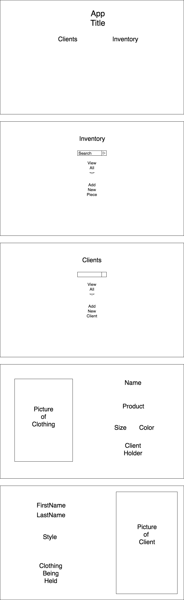

<h1>Client Checkout App</h1>

<h2>Overview</h2>

In our third project, we (SEI24) were asked to make a MERN-stack application. I decided to make a CRM for wardrobe stylists. Inspired by my brother-in-law's work, I wanted to find a way to distill his operation into one space. The app allows for CRUD of all internal APIs, which allows the user to manage a client list, invoices, and an inventory.

 

<a href='https://fashion-forward-app.herokuapp.com/'><h2>Heroku Link</h2></a>
 

<a href="https://git.generalassemb.ly/jwharrell/Project-3-App/projects/1"><h2>Project Board</h2></a>
 

<h2>ERD</h2>

 

<h2>Wireframe</h2>

 

<h2>Technologies Used</h2>
<ul>
<li>HTML</li>
<li>CSS</li>
<li>JavaScript</li>
<li>MongoDB/mongoose</li>
<li>Express.js</li>
<li>React.js</li>
<li>Node.js</li>
<li>Postman</li>
<li>Heroku</li>
<li>GitHub</li>
<li>VS Code</li>
</ul>

 

<h2>Future Edition Additions</h2>

<ul>
<li>More Styling</li>
<li>More Adaptive UI</li>
<li>Ebay API or some other marketplace</li>
</ul>
